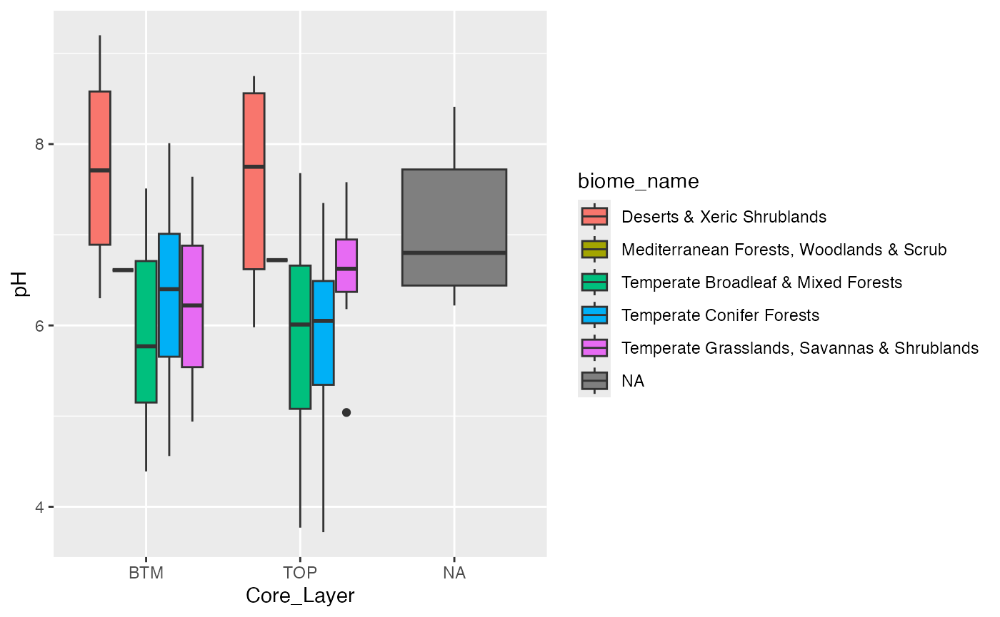
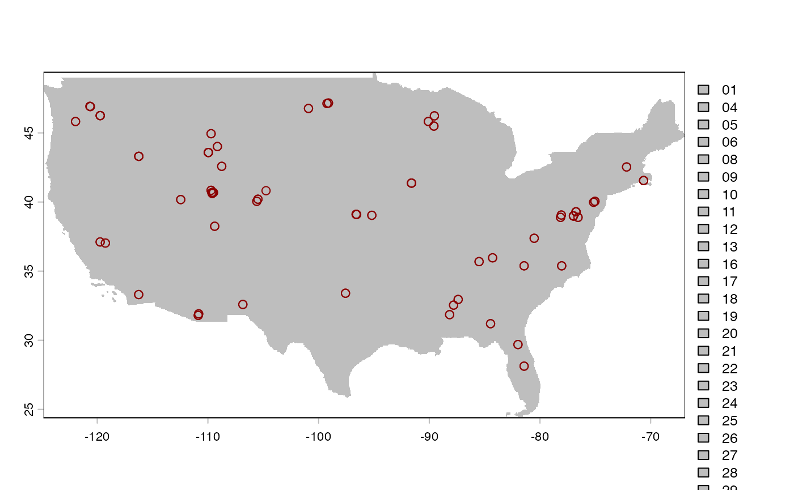
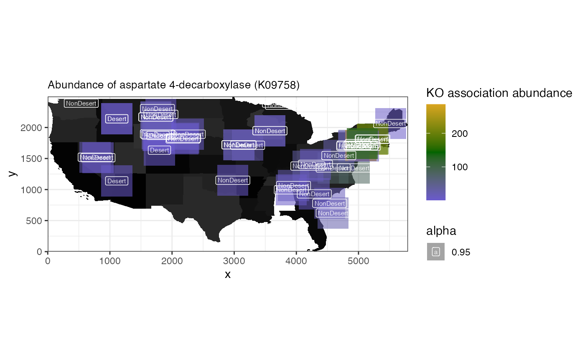

# spammR microbiome evaluation

This vignette walks you through an example of using spammR for
metagenomic data across a geographic area.

## R and other dependencies

We require a few packages for the mapping requirements that are beyond
the basic spammR tools.

The following R packages are required: -
[spammR](https://github.com/PNNL-CompBio/spammR) -
[sf](https://r-spatial.github.io/sf/index.html) relies on other non
R-libraries (see
[Installing](https://r-spatial.github.io/sf/index.html#installing) for
more details on how to install sf including the dependencies)

The following non-R packages may be required: -
[GEOS](https://libgeos.org/usage/install/) -
[PROJ](https://proj.org/en/stable/install.html) -
[GDAL](https://gdal.org/en/stable/download.html)

``` r
library(spammR)
library(ggplot2)
library(tibble)
library(magrittr)
library(dplyr)
## these two libraries are only used for geographic data
library(sf)
library(terra)
```

## Metagenomic data formatting requirements

The data that we will be working with is a [KEGG
ortholog](https://www.genome.jp/kegg/ko.html) enrichment from the 1000
soils project. The [1000 soils
project](https://www.emsl.pnnl.gov/project/60141) has the nice feature
that each location has two sampling at different depths (‘top’ and
‘bottom’). We will use this circumstance in combination with the KO
enrichment to generate a pathway enrichment for each sample location and
depth and then visualize the differential between the two depths.

We have downloaded the 1000 soil data and stored it as two separate
files that can be loaded directly in the package.

The first file is the actual KO measurements.

    ## [1] TRUE

We can then create a metadata file that The KO metadata table will
contain a mapping from KO identifier - row names in the Omics
Measurement table - to a more descriptive annotation.For testing
purposes this currently is only the row names & incremented integer
values.

``` r
oneKSoilsOmicsMeta <- data.frame(KO = character(nrow(oneKSoilsData)))

oneKSoilsOmicsMeta["KO"] <- rownames(oneKSoilsData)
oneKSoilsOmicsMeta["annotation"] <- seq(1, by = 1, 
                                        length.out = nrow(oneKSoilsOmicsMeta))
oneKSoilsOmicsMeta["annotation"] <- lapply(oneKSoilsOmicsMeta["annotation"], 
                                           as.character)
head(oneKSoilsOmicsMeta)
```

    ##       KO annotation
    ## 1 K00001          1
    ## 2 K00002          2
    ## 3 K00003          3
    ## 4 K00004          4
    ## 5 K00005          5
    ## 6 K00006          6

Next we need to import the lat/long information of the locations where
the 1000 soil project samples where extracted. The file was retrieved
from the [1000 Soils Project Shiny
App](https://shinyproxy.emsl.pnnl.gov/app/monet-vis-testbed). The
metadata was retrieved by using the Query\>Information tab. On the left
side (the “Information Menu”) we select `SAMPLE_ID`, `latitude` &
`longitude` and download the resulting mapping.

Not all `Sample_ID` entries have complete lat/long data. To generate a
`sf` object (see below) which will be needed as input to create a
`terra:SpatRaster` object the input table can only contain complete
cases (i.e. no `NaN` values). The sample metadata contains information
about the type of Biome, the layer of the soil sample (‘top’ or
‘bottom’), and the pH, for example, as well as the coordinates.

``` r
data("oneKSoilsMeta")
head(oneKSoilsMeta)
```

    ##   Sample_ID Site_Code Core_Layer latitude  longitude Elev.m Soil.Temperature.C
    ## 1  ANZA_TOP      ANZA        TOP 33.30533 -116.25401    191               42.7
    ## 2  ANZA_BTM      ANZA        BTM 33.30533 -116.25401    191               42.7
    ## 3  BLAN_TOP      BLAN        TOP 39.05941  -78.07207    174               19.7
    ## 4  BLAN_BTM      BLAN        BTM 39.05941  -78.07207    174               19.7
    ## 5  CFS1_TOP      CFS1        TOP 35.38280  -78.03818     24               18.5
    ## 6  CFS1_BTM      CFS1        BTM 35.38280  -78.03818     24               18.5
    ##   VolWaterContent.m3.m3   pH K_mg_per_kg SO4.S_mg_per_kg B_mg_per_kg
    ## 1                0.0490 8.75         107               4        0.25
    ## 2                0.0490 9.20          82               4        0.20
    ## 3                0.1740 6.50         189              10        0.42
    ## 4                0.1740 5.92         122              19        0.27
    ## 5                0.0515 6.66         231              NA          NA
    ## 6                0.0515 6.98         107               6        0.26
    ##   Zn_mg_per_kg Mn_mg_per_kg Cu_mg_per_kg Fe_mg_per_kg Ca_Meq_per_100_g
    ## 1          0.2          1.9          0.1           13             3.27
    ## 2          0.3          1.1          0.1           14             3.05
    ## 3          0.7         28.3          0.7           54             5.47
    ## 4          0.2         15.9          0.5           16             4.31
    ## 5           NA           NA           NA           NA             2.41
    ## 6          0.3          0.7          0.5           18             2.93
    ##   Mg_Meq_per_100_g Na_Meq_per_100_g BIOME                          biome_name
    ## 1             0.26             0.10    13          Deserts & Xeric Shrublands
    ## 2             0.42             0.08    13          Deserts & Xeric Shrublands
    ## 3             0.81             0.05     4 Temperate Broadleaf & Mixed Forests
    ## 4             0.57             0.06     4 Temperate Broadleaf & Mixed Forests
    ## 5             0.68             0.08     5           Temperate Conifer Forests
    ## 6             1.14             0.06     5           Temperate Conifer Forests

``` r
ggplot2::ggplot(oneKSoilsMeta, aes(x = Core_Layer, y = pH, fill = biome_name)) +
  geom_boxplot()
```

    ## Warning: Removed 4 rows containing non-finite outside the scale range
    ## (`stat_boxplot()`).



## Geographic map formatting requirements

Maps can be downloaded from public repositories as a ‘shape’ file that
can then be processed for coordinates and visualization. Here we show
how to retrieve a shape file d from the [US Census
Bureau](https://www.census.gov/cgi-bin/geo/shapefiles/index.php) with
the following parameters:

- Year = 2024
- Layer type = “States (and equivalent)”

Or downloaded in a zip file from the \[census FTP site\]
(<https://www2.census.gov/geo/tiger/TIGER2024/STATE/>).

The code chunk below will not be executed but is displayed as example of
how to load a downloaded shape file using the sf package.

``` r
us_map <- sf::st_read("../data/tl_2024_us_state/tl_2024_us_state.shp", 
                      quiet = TRUE)
us_map
```

Instead will load the file from the supplied `rda` file:

    ## [1] TRUE

This map contains the entire US, so for visualization purposes we focus
only on the continental US.

``` r
us_continental <- c(
  "WV", "FL", "IL", "MN", "MD", "RI", "ID", "NH", "NC", "VT",
  "CT", "DE", "NM", "CA", "NJ", "WI", "OR", "NE", "PA", "WA",
  "LA", "GA", "AL", "UT", "OH", "TX", "CO", "SC", "OK", "TN",
  "WY", "ND", "KY", "ME", "NY", "NV", "MI", "AR", "MS", "MO",
  "MT", "KS", "IN", "SD", "MA", "VA", "DC", "IA", "AZ"
)

s_us_cont <- us_map %>%
  .[.$STUSPS %in% us_continental, ] %>%
  vect()
s_us_cont
```

    ##  class       : SpatVector 
    ##  geometry    : polygons 
    ##  dimensions  : 49, 15  (geometries, attributes)
    ##  extent      : -124.849, -66.88544, 24.39631, 49.38448  (xmin, xmax, ymin, ymax)
    ##  coord. ref. : lon/lat NAD83 (EPSG:4269) 
    ##  names       : REGION DIVISION STATEFP  STATENS GEOID     GEOIDFQ STUSPS
    ##  type        :  <chr>    <chr>   <chr>    <chr> <chr>       <chr>  <chr>
    ##  values      :      3        5      54 01779805    54 0400000US54     WV
    ##                     3        5      12 00294478    12 0400000US12     FL
    ##                     2        3      17 01779784    17 0400000US17     IL
    ##           NAME  LSAD MTFCC (and 5 more)
    ##          <chr> <chr> <chr>             
    ##  West Virginia    00 G4000             
    ##        Florida    00 G4000             
    ##       Illinois    00 G4000

Now that we have the coordinate information we need to convert it to
pixels using the `terra` package, which requires creating a
rasterization template using the”
[`terra::SpatRaster`](https://rspatial.github.io/terra/reference/SpatRaster-class.html).
From this object we can generate a rasterized image while retaining the
location information and ability to project the map into a different map
projection.

The `terra` package can read in the shape file as follows:

``` r
template <- terra::rast(
  s_us_cont,
  res = 0.01
)
```

And then create a rasterized landmass of the continental US:

``` r
# us_raster <- rasterize(s_us_cont, template, background=0)
# us_raster <- rasterize(as.lines(s_us_cont), template, field='STATEFP', 
# touches=TRUE)

us_raster <- terra::rasterize(s_us_cont, template, field = "STATEFP")
```

### Mapping soil locations to map

Next we generate an `sf` object from the soils coordinate data so that
we can then map it to the same rasterized image as the US map object:

``` r
oneKSoilsMeta <- oneKSoilsMeta[!is.na(oneKSoilsMeta$latitude) & 
                                 !is.na(oneKSoilsMeta$longitude), ]
coords <- sf::st_as_sf(oneKSoilsMeta, coords = c("longitude", "latitude"), 
                       remove = TRUE)
sf::st_crs(coords) <- sf::st_crs(s_us_cont)
coords
```

    ## Simple feature collection with 127 features and 19 fields
    ## Geometry type: POINT
    ## Dimension:     XY
    ## Bounding box:  xmin: -121.9607 ymin: 28.12584 xmax: -70.63536 ymax: 47.16306
    ## Geodetic CRS:  NAD83
    ## First 10 features:
    ##    Sample_ID Site_Code Core_Layer Elev.m Soil.Temperature.C
    ## 1   ANZA_TOP      ANZA        TOP    191               42.7
    ## 2   ANZA_BTM      ANZA        BTM    191               42.7
    ## 3   BLAN_TOP      BLAN        TOP    174               19.7
    ## 4   BLAN_BTM      BLAN        BTM    174               19.7
    ## 5   CFS1_TOP      CFS1        TOP     24               18.5
    ## 6   CFS1_BTM      CFS1        BTM     24               18.5
    ## 7   CFS2_TOP      CFS2        TOP     24               23.0
    ## 8   CFS2_BTM      CFS2        BTM     24               23.0
    ## 9   CLBJ_BTM      CLBJ        BTM    274               18.4
    ## 10  CLBJ_TOP      CLBJ        TOP    274               18.4
    ##    VolWaterContent.m3.m3   pH K_mg_per_kg SO4.S_mg_per_kg B_mg_per_kg
    ## 1                 0.0490 8.75         107               4        0.25
    ## 2                 0.0490 9.20          82               4        0.20
    ## 3                 0.1740 6.50         189              10        0.42
    ## 4                 0.1740 5.92         122              19        0.27
    ## 5                 0.0515 6.66         231              NA          NA
    ## 6                 0.0515 6.98         107               6        0.26
    ## 7                 0.0695 6.66         134               4        0.11
    ## 8                 0.0695 6.78          66               2        0.06
    ## 9                 0.3380 4.94         144               5        0.18
    ## 10                0.3380 7.28         156               6        0.40
    ##    Zn_mg_per_kg Mn_mg_per_kg Cu_mg_per_kg Fe_mg_per_kg Ca_Meq_per_100_g
    ## 1           0.2          1.9          0.1           13             3.27
    ## 2           0.3          1.1          0.1           14             3.05
    ## 3           0.7         28.3          0.7           54             5.47
    ## 4           0.2         15.9          0.5           16             4.31
    ## 5            NA           NA           NA           NA             2.41
    ## 6           0.3          0.7          0.5           18             2.93
    ## 7           3.6          5.1          2.2           48             1.76
    ## 8           0.3          2.0          0.3           17             1.13
    ## 9           0.4          9.6          0.2           21             1.42
    ## 10          1.6          5.9          0.2           12             9.02
    ##    Mg_Meq_per_100_g Na_Meq_per_100_g BIOME
    ## 1              0.26             0.10    13
    ## 2              0.42             0.08    13
    ## 3              0.81             0.05     4
    ## 4              0.57             0.06     4
    ## 5              0.68             0.08     5
    ## 6              1.14             0.06     5
    ## 7              0.50             0.05     4
    ## 8              0.32             0.04     4
    ## 9              1.08             0.10     8
    ## 10             1.04             0.07     8
    ##                                     biome_name                   geometry
    ## 1                   Deserts & Xeric Shrublands  POINT (-116.254 33.30533)
    ## 2                   Deserts & Xeric Shrublands  POINT (-116.254 33.30533)
    ## 3          Temperate Broadleaf & Mixed Forests POINT (-78.07207 39.05941)
    ## 4          Temperate Broadleaf & Mixed Forests POINT (-78.07207 39.05941)
    ## 5                    Temperate Conifer Forests  POINT (-78.03818 35.3828)
    ## 6                    Temperate Conifer Forests  POINT (-78.03818 35.3828)
    ## 7          Temperate Broadleaf & Mixed Forests POINT (-81.43417 35.38329)
    ## 8          Temperate Broadleaf & Mixed Forests POINT (-81.43417 35.38329)
    ## 9  Temperate Grasslands, Savannas & Shrublands POINT (-97.57043 33.40164)
    ## 10 Temperate Grasslands, Savannas & Shrublands POINT (-97.57043 33.40164)

Using the same rasterization template as we used above, we can make the
soils coordinates fit on pixes on the US map.

``` r
coords_rast <- terra::rasterize(coords, template)
coords_rast
```

    ## class       : SpatRaster 
    ## size        : 2499, 5796, 1  (nrow, ncol, nlyr)
    ## resolution  : 0.01, 0.01  (x, y)
    ## extent      : -124.849, -66.88897, 24.39631, 49.38631  (xmin, xmax, ymin, ymax)
    ## coord. ref. : lon/lat NAD83 (EPSG:4269) 
    ## source(s)   : memory
    ## name        : last 
    ## min value   :    1 
    ## max value   :    1

#### get the “Pixel” x/y (NOT lat/long x/y) of metagenome samples

Finally to retrieve the “pixel” coordinates instead of the x/y
(lat/long) coordinates that are recorded in the
[`terra::SpatRaster`](https://rspatial.github.io/terra/reference/SpatRaster-class.html)
objects the following procedure is employed:

- use
  [`extract()`](https://magrittr.tidyverse.org/reference/aliases.html)
  to get the cells which the coordinates are projected into in the
  raster image
- use [`lapply()`](https://rdrr.io/r/base/lapply.html) get the raster
  coordinates (‘pixel’ x/y) for each row with
  [`terra::rowColFromCell()`](https://rspatial.github.io/terra/reference/xyCellFrom.html)
- use [`cbind()`](https://rdrr.io/r/base/cbind.html) to combine the
  cells, ‘pixel’ x/y and original sample coordinate `data.frame`
- use
  [`dplyr::rename()`](https://dplyr.tidyverse.org/reference/rename.html)
  to clean up `data.frame`

This process does come with slight differences in lat/long. Most likely
due to the rasterization process?

``` r
cells <- terra::extract(coords_rast, coords, xy = TRUE, cells = TRUE)
print(head(cells))
```

    ##   ID last    cell          x        y
    ## 1  1    1 9320828 -116.25397 33.30131
    ## 2  2    1 9320828 -116.25397 33.30131
    ## 3  3    1 5986150  -78.07397 39.06131
    ## 4  4    1 5986150  -78.07397 39.06131
    ## 5  5    1 8119082  -78.03397 35.38131
    ## 6  6    1 8119082  -78.03397 35.38131

``` r
cells_tmp <- terra::extract(coords_rast, coords, xy = TRUE, cells = TRUE)
xy_rast <- lapply(cells["cell"], function(x) rowColFromCell(coords_rast, x))
cells <- cells_tmp %>%
  cbind(., oneKSoilsMeta, xy_rast) %>%
  dplyr::rename(., y_pixels = "cell.1", x_pixels = "cell.2") %>%
  subset(., select = -c(x, y, ID, last))
cells$y_pixels <- nrow(coords_rast) - cells$y_pixels
```

Those need to be finally written out / transferred into the `spammR`
package for further use.

#### Exporting the rasterized map

The rasterized map can be exported with the command below.

``` r
terra::writeRaster(us_raster, "us_map.png", NAflag = 0, overwrite = TRUE)
```

#### Examplary plotting

``` r
coords_test <- sf::st_as_sf(oneKSoilsMeta, 
                            coords = c("longitude", "latitude"), 
                            remove = TRUE)
sf::st_crs(coords_test) <- sf::st_crs(s_us_cont)
plot(us_raster, col = "grey")
# lines(as.polygons(us_raster), col='black')
plot(coords_test, col = "darkred", add = TRUE)
```

    ## Warning in plot.sf(coords_test, col = "darkred", add = TRUE): ignoring all but
    ## the first attribute



## Using `spammR` on metagenomic geographic data

Now that the data are properly formatted we can put them into a
`SpatialExperiment` object that is needed by spammR. The data is
comprised of:

- Omics Measurements: species abundances across regions
- Omics Metadata: metadata from these species
- Sample Metadata: information about the sample location
- Image files (generated by the above code): file representing image
  sample

### Sample Metadata

Here we build the sample metadata table given the previously generated
coordinate raster during the rasterization of the map. The
SpatialExperiment object requires information about the x and y
coordinates and information about each spot in the image for which we
have omics data.

``` r
dm <- cells
rownames(dm) <- dm$Sample_ID
# dm[,1] <- NULL
dm[, "cell"] <- NULL
dm[, "longitude.1"] <- NULL
dm[, "latitude.1"] <- NULL
dm[, "Image"] <- 0
dm[, "x_max"] <- ncol(coords_rast)
dm[, "y_max"] <- nrow(coords_rast)
dm[, "x_origin"] <- 0
dm[, "y_origin"] <- 0
dm[, "spot_height"] <- 500
dm[, "spot_width"] <- 500
dm[, "above_40_deg_lat"] <- dplyr::if_else(dm[, "latitude"] >= 40, 
                                                  true = 1, false = 0)
dm[, "psychrophile"] <- dplyr::if_else(dm[, "Soil.Temperature.C"] <= 15, 
                                       true = 1, false = 0)
dm[, "Core_Layer_bin"] <- dplyr::if_else(dm[, "Core_Layer"] == "TOP", 
                                         true = "TOP", false = "BTM")
dm[, "Desert"] <- dplyr::if_else(dm[, "BIOME"] == "13", 
                                 true = "Desert", false = "NonDesert")

data_meta <- dm
head(data_meta)
```

    ##          Sample_ID Site_Code Core_Layer latitude  longitude Elev.m
    ## ANZA_TOP  ANZA_TOP      ANZA        TOP 33.30533 -116.25401    191
    ## ANZA_BTM  ANZA_BTM      ANZA        BTM 33.30533 -116.25401    191
    ## BLAN_TOP  BLAN_TOP      BLAN        TOP 39.05941  -78.07207    174
    ## BLAN_BTM  BLAN_BTM      BLAN        BTM 39.05941  -78.07207    174
    ## CFS1_TOP  CFS1_TOP      CFS1        TOP 35.38280  -78.03818     24
    ## CFS1_BTM  CFS1_BTM      CFS1        BTM 35.38280  -78.03818     24
    ##          Soil.Temperature.C VolWaterContent.m3.m3   pH K_mg_per_kg
    ## ANZA_TOP               42.7                0.0490 8.75         107
    ## ANZA_BTM               42.7                0.0490 9.20          82
    ## BLAN_TOP               19.7                0.1740 6.50         189
    ## BLAN_BTM               19.7                0.1740 5.92         122
    ## CFS1_TOP               18.5                0.0515 6.66         231
    ## CFS1_BTM               18.5                0.0515 6.98         107
    ##          SO4.S_mg_per_kg B_mg_per_kg Zn_mg_per_kg Mn_mg_per_kg Cu_mg_per_kg
    ## ANZA_TOP               4        0.25          0.2          1.9          0.1
    ## ANZA_BTM               4        0.20          0.3          1.1          0.1
    ## BLAN_TOP              10        0.42          0.7         28.3          0.7
    ## BLAN_BTM              19        0.27          0.2         15.9          0.5
    ## CFS1_TOP              NA          NA           NA           NA           NA
    ## CFS1_BTM               6        0.26          0.3          0.7          0.5
    ##          Fe_mg_per_kg Ca_Meq_per_100_g Mg_Meq_per_100_g Na_Meq_per_100_g BIOME
    ## ANZA_TOP           13             3.27             0.26             0.10    13
    ## ANZA_BTM           14             3.05             0.42             0.08    13
    ## BLAN_TOP           54             5.47             0.81             0.05     4
    ## BLAN_BTM           16             4.31             0.57             0.06     4
    ## CFS1_TOP           NA             2.41             0.68             0.08     5
    ## CFS1_BTM           18             2.93             1.14             0.06     5
    ##                                   biome_name y_pixels x_pixels Image x_max
    ## ANZA_TOP          Deserts & Xeric Shrublands      890      860     0  5796
    ## ANZA_BTM          Deserts & Xeric Shrublands      890      860     0  5796
    ## BLAN_TOP Temperate Broadleaf & Mixed Forests     1466     4678     0  5796
    ## BLAN_BTM Temperate Broadleaf & Mixed Forests     1466     4678     0  5796
    ## CFS1_TOP           Temperate Conifer Forests     1098     4682     0  5796
    ## CFS1_BTM           Temperate Conifer Forests     1098     4682     0  5796
    ##          y_max x_origin y_origin spot_height spot_width above_40_deg_lat
    ## ANZA_TOP  2499        0        0         500        500                0
    ## ANZA_BTM  2499        0        0         500        500                0
    ## BLAN_TOP  2499        0        0         500        500                0
    ## BLAN_BTM  2499        0        0         500        500                0
    ## CFS1_TOP  2499        0        0         500        500                0
    ## CFS1_BTM  2499        0        0         500        500                0
    ##          psychrophile Core_Layer_bin    Desert
    ## ANZA_TOP            0            TOP    Desert
    ## ANZA_BTM            0            BTM    Desert
    ## BLAN_TOP            0            TOP NonDesert
    ## BLAN_BTM            0            BTM NonDesert
    ## CFS1_TOP            0            TOP NonDesert
    ## CFS1_BTM            0            BTM NonDesert

### CLEANING UP OF DATA

Limiting our selfs to only the top layer of the soil column.

``` r
data_meta <- subset(data_meta, Sample_ID %in% colnames(oneKSoilsData))
oneKSoilsData <- subset(oneKSoilsData, select = data_meta$Sample_ID)
data_meta <- data_meta[data_meta$Core_Layer == "TOP", ]
oneKSoilsData <- oneKSoilsData[, grep("TOP", x = names(oneKSoilsData))]
```

### Create `SpatialExperiment` object

Now that our metadata is formatted correctly we can create the
spatialExperiment object.

``` r
microbiome.spe <- spammR::convert_to_spe(
  oneKSoilsData, ## pooled data table
  data_meta, ## pooled metadata
  oneKSoilsOmicsMeta, ## protein identifiers
  feature_meta_colname = "KO", # column name
  spatial_coords_colnames = c("x_pixels", "y_pixels"),
  image_files = c("us_map.png"),
  image_sample_ids = "1000 Soils",
  sample_id = "1000 Soils",
  image_ids = c("0"),
  assay_name = "KO"
)
```

### Metagenomic differential expression and enrichment

The pathway enrichment analysis is done based on the presence and
absence of KO associations found within the individual metagenomes. As
such we are not strictly working with “gene abundances” that would be
expected for a more traditional differential expression and pathway
enrichment analysis. Conversely the “abundance” measurements of the
individual KOs also distribute differently to what would be expected. To
this end we are relying on the count based differential expression
analysis that is based on
[`limma::voom`](https://rdrr.io/pkg/limma/man/voom.html).

``` r
diff_ex <- spammR::calc_spatial_diff_ex(
  microbiome.spe,
  assay_name = "KO",
  count_based = TRUE,
  log_transformed = FALSE,
  category_col = "Desert"
)
```

    ## We found 562 features with a logFC greater than 1 and 
    ##                  an ajusted p-value less than 0.05

``` r
sig_ko <- subset(rowData(diff_ex), Desert_vs_NonDesert.adj.P.Val.limma < 0.05)
ups <- subset(sig_ko, Desert_vs_NonDesert.logFC.limma > 0)
downs <- subset(sig_ko, Desert_vs_NonDesert.logFC.limma < 0)

print(paste(
  "We found", nrow(sig_ko), "significantly differentally abundant KOs",
  nrow(ups), "upregulated KOs and", nrow(downs), "downregulated"
))
```

    ## [1] "We found 575 significantly differentally abundant KOs 483 upregulated KOs and 92 downregulated"

``` r
ups %>% as_tibble(.) %>%
  arrange(., -Desert_vs_NonDesert.logFC.limma)
```

    ## # A tibble: 483 × 8
    ##    KO     annotation Desert_vs_NonDesert.logFC.limma Desert_vs_NonDesert.AveEx…¹
    ##    <chr>  <chr>                                <dbl>                       <dbl>
    ##  1 K21136 11079                                 4.30                        5.91
    ##  2 K15547 8600                                  4.15                        4.98
    ##  3 K09758 5602                                  4.07                        5.42
    ##  4 K01535 1144                                  4.04                        5.02
    ##  5 K15549 8602                                  4.04                        5.18
    ##  6 K07085 4377                                  3.87                        7.23
    ##  7 K12137 6892                                  3.87                        6.94
    ##  8 K13926 7769                                  3.71                        5.59
    ##  9 K05817 3685                                  3.64                        5.74
    ## 10 K21134 11077                                 3.56                        7.72
    ## # ℹ 473 more rows
    ## # ℹ abbreviated name: ¹​Desert_vs_NonDesert.AveExpr.limma
    ## # ℹ 4 more variables: Desert_vs_NonDesert.t.limma <dbl>,
    ## #   Desert_vs_NonDesert.P.Value.limma <dbl>,
    ## #   Desert_vs_NonDesert.adj.P.Val.limma <dbl>,
    ## #   Desert_vs_NonDesert.B.limma <dbl>

### Spatial heatmap showing abundance of significant KO

K09758 (aspartate 4-decarboxylase) being one of the “upregulated KOs” we
can visualize the abundances across the different sampling locations
with `spammr::spatial_heatmap()`

``` r
spatial_heatmap(
  microbiome.spe,
  feature = "K09758",
  # feature_type = 'KO',
  assay_name = "KO",
  sample_id = "1000 Soils",
  image_id = "0",
  sample_label_size = 2.0, 
  title_size = 10, 
  label_column = "Desert",
  metric_display = "KO association abundance",
  plot_title = "Abundance of aspartate 4-decarboxylase (K09758)",
  interactive = FALSE
)
```

    ## Warning: Removed 2 rows containing missing values or values outside the scale range
    ## (`geom_label()`).



### Pathway enrichment

For the pathway enrichment part of the anaysis we first need to load
“genesets” in the required format for leapR that will be called
internally. The geneset is effectively a list of KOs that are associated
with individual KEGG pathways.

``` r
kk <- download.file("https://api.figshare.com/v2/file/download/55158818", 
                    destfile = "kegg.rda", quiet = TRUE)
load("kegg.rda")
file.remove("kegg.rda")
```

    ## [1] TRUE

Next we are performing the enrichment analysis with a p-value cut-off of
p-value \< 0.05

``` r
ora.res <- spammR::enrich_ora(diff_ex, geneset = keggPathwayToKo, 
                              geneset_name = "KEGG pathways", 
                              feature_column = "KO", pval_thresh = 0.05)


filtered_res <- ora.res %>% 
  rownames_to_column(., var = 'KEGG_Pathway') %>%
  as_tibble(.) %>%
  filter(., oddsratio > 1 & BH_pvalue < 0.05) %>%
  arrange(-oddsratio) %>%
  select(KEGG_Pathway, oddsratio, BH_pvalue)

pathway_names <- cbind(keggPathwayToKo$name, keggPathwayToKo$desc) %>% 
  as_tibble() %>% 
  rename(., KEGG_Pathway = V1, KEGG_pathway_name = V2)
```

    ## Warning: The `x` argument of `as_tibble.matrix()` must have unique column names if
    ## `.name_repair` is omitted as of tibble 2.0.0.
    ## ℹ Using compatibility `.name_repair`.
    ## This warning is displayed once per session.
    ## Call `lifecycle::last_lifecycle_warnings()` to see where this warning was
    ## generated.

``` r
left_join(filtered_res, pathway_names, by = 'KEGG_Pathway')
```

    ## # A tibble: 8 × 4
    ##   KEGG_Pathway oddsratio   BH_pvalue KEGG_pathway_name              
    ##   <chr>            <dbl>       <dbl> <chr>                          
    ## 1 map01320          8.25 0.000266    Sulfur cycle                   
    ## 2 map00540          7.64 0.000380    Lipopolysaccharide biosynthesis
    ## 3 map00480          5.00 0.0302      Glutathione metabolism         
    ## 4 map00362          4.91 0.0000118   Benzoate degradation           
    ## 5 map00920          4.44 0.000266    Sulfur metabolism              
    ## 6 map00627          3.98 0.0183      Aminobenzoate degradation      
    ## 7 map02020          2.70 0.000000387 Two-component system           
    ## 8 map02010          2.25 0.000266    ABC transporters

``` r
ora.res <- tibble::rownames_to_column(ora.res, "pathways")
pathway_prots <- subset(ora.res, pathways == "map01320") |>
  dplyr::select(ingroupnames)
pathway_prots <- unlist(strsplit(pathway_prots[1, ], split = ", "))
```

``` r
spatial_heatmap(
    microbiome.spe,
    feature = pathway_prots,
    assay_name = "KO",
    sample_id = "1000 Soils",
    image_id = "0",
    label_column = "Desert",
    sample_label_size = 2.0,
    title_size = 10, 
    metric_display = "Enriched KO Groups",
    plot_title = "Sulfur cycle",
    interactive = FALSE
)
```

    ## Warning: Removed 2 rows containing missing values or values outside the scale range
    ## (`geom_label()`).


### Session Information

``` r
sessionInfo()
```

    ## R version 4.5.2 (2025-10-31)
    ## Platform: aarch64-apple-darwin20
    ## Running under: macOS Tahoe 26.2
    ## 
    ## Matrix products: default
    ## BLAS:   /System/Library/Frameworks/Accelerate.framework/Versions/A/Frameworks/vecLib.framework/Versions/A/libBLAS.dylib 
    ## LAPACK: /Library/Frameworks/R.framework/Versions/4.5-arm64/Resources/lib/libRlapack.dylib;  LAPACK version 3.12.1
    ## 
    ## locale:
    ## [1] en_US.UTF-8/en_US.UTF-8/en_US.UTF-8/C/en_US.UTF-8/en_US.UTF-8
    ## 
    ## time zone: America/Los_Angeles
    ## tzcode source: internal
    ## 
    ## attached base packages:
    ## [1] stats4    stats     graphics  grDevices utils     datasets  methods  
    ## [8] base     
    ## 
    ## other attached packages:
    ##  [1] terra_1.8-93                sf_1.0-24                  
    ##  [3] dplyr_1.1.4                 magrittr_2.0.4             
    ##  [5] tibble_3.3.1                ggplot2_4.0.1              
    ##  [7] spammR_0.99.17              limma_3.66.0               
    ##  [9] SpatialExperiment_1.20.0    SingleCellExperiment_1.32.0
    ## [11] SummarizedExperiment_1.40.0 Biobase_2.70.0             
    ## [13] GenomicRanges_1.62.1        Seqinfo_1.0.0              
    ## [15] IRanges_2.44.0              S4Vectors_0.48.0           
    ## [17] BiocGenerics_0.56.0         generics_0.1.4             
    ## [19] MatrixGenerics_1.22.0       matrixStats_1.5.0          
    ## [21] BiocStyle_2.38.0           
    ## 
    ## loaded via a namespace (and not attached):
    ##   [1] DBI_1.2.3           deldir_2.0-4        gridExtra_2.3      
    ##   [4] s2_1.1.9            rlang_1.1.7         otel_0.2.0         
    ##   [7] e1071_1.7-17        compiler_4.5.2      png_0.1-8          
    ##  [10] systemfonts_1.3.1   vctrs_0.7.1         wk_0.9.5           
    ##  [13] pkgconfig_2.0.3     fastmap_1.2.0       backports_1.5.0    
    ##  [16] magick_2.9.0        XVector_0.50.0      labeling_0.4.3     
    ##  [19] ggraph_2.2.2        utf8_1.2.6          rmarkdown_2.30     
    ##  [22] tzdb_0.5.0          ragg_1.5.0          purrr_1.2.1        
    ##  [25] xfun_0.56           cachem_1.1.0        jsonlite_2.0.0     
    ##  [28] DelayedArray_0.36.0 tweenr_2.0.3        broom_1.0.12       
    ##  [31] R6_2.6.1            bslib_0.10.0        RColorBrewer_1.1-3 
    ##  [34] reticulate_1.44.1   boot_1.3-32         car_3.1-3          
    ##  [37] jquerylib_0.1.4     leapR_0.99.6        Rcpp_1.1.1         
    ##  [40] bookdown_0.46       knitr_1.51          readr_2.1.6        
    ##  [43] Matrix_1.7-4        igraph_2.2.1        tidyselect_1.2.1   
    ##  [46] rstudioapi_0.18.0   abind_1.4-8         yaml_2.3.12        
    ##  [49] viridis_0.6.5       codetools_0.2-20    lattice_0.22-7     
    ##  [52] withr_3.0.2         S7_0.2.1            evaluate_1.0.5     
    ##  [55] desc_1.4.3          units_1.0-0         proxy_0.4-29       
    ##  [58] spData_2.3.4        polyclip_1.10-7     pillar_1.11.1      
    ##  [61] BiocManager_1.30.27 ggpubr_0.6.2        carData_3.0-5      
    ##  [64] KernSmooth_2.23-26  plotly_4.12.0       sp_2.2-0           
    ##  [67] hms_1.1.4           scales_1.4.0        class_7.3-23       
    ##  [70] glue_1.8.0          lazyeval_0.2.2      tools_4.5.2        
    ##  [73] data.table_1.18.2.1 ggnewscale_0.5.2    ggsignif_0.6.4     
    ##  [76] fs_1.6.6            graphlayouts_1.2.2  tidygraph_1.3.1    
    ##  [79] grid_4.5.2          spdep_1.4-1         impute_1.84.0      
    ##  [82] tidyr_1.3.2         ggforce_0.5.0       Formula_1.2-5      
    ##  [85] cli_3.6.5           textshaping_1.0.4   S4Arrays_1.10.1    
    ##  [88] viridisLite_0.4.2   gtable_0.3.6        rstatix_0.7.3      
    ##  [91] sass_0.4.10         digest_0.6.39       classInt_0.4-11    
    ##  [94] SparseArray_1.10.8  ggrepel_0.9.6       rjson_0.2.23       
    ##  [97] htmlwidgets_1.6.4   farver_2.1.2        memoise_2.0.1      
    ## [100] htmltools_0.5.9     pkgdown_2.2.0       lifecycle_1.0.5    
    ## [103] httr_1.4.7          statmod_1.5.1       MASS_7.3-65
